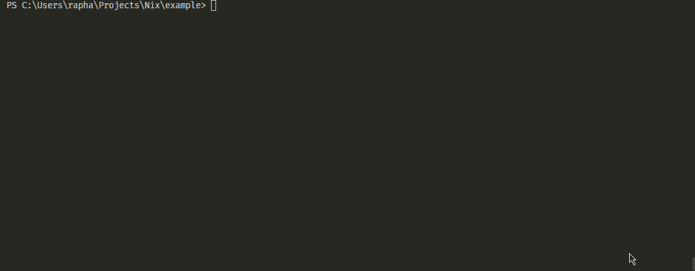

<div align="center">
  
</div>

<p align="center">
  <h1 align="center">Nix</h1>
  <p align="center">Nothing to create a api.</p>
</p>

<p align="center">
  <a href="#installing">Installing</a> |
  <a href="#getting-started">Getting Started</a> |
  <a href="https://nixjs.netlify.com/">Docs</a>
</p>


**Nix** is a library for create APIs fast. You need nothing to create a api. The reason to create this is the boring process to create a simple api, i need make this be simple.

**IT'S FAST!!**


## Installing

```
npm install -g nix-api
```

## Getting Started



If you run the command here:

```txt
|_cookie.json
|_myFolder/
  |_person.json
  |_toRead.md
  |_subFolder/
    |_anything.js
    |_home.html

```

### Run

```
nix
```

### You will receive

```
GET: cookie
GET: myFolder/person
GET: myFolder/toRead
GET: myFolder/subFolder/anything
GET: myFolder/subFolder/home
```

Go to `localhost:PORT/GET_PATH`

## Mega Ultra Super Advanced

|Argument|Description|
|--------|-----------|
|`-p`, `--port`| Set a custom port to api|


## Contributing

* Fork this project
* Create a branch with `your-name/your-feature`
* Make a pull request
* Be happy